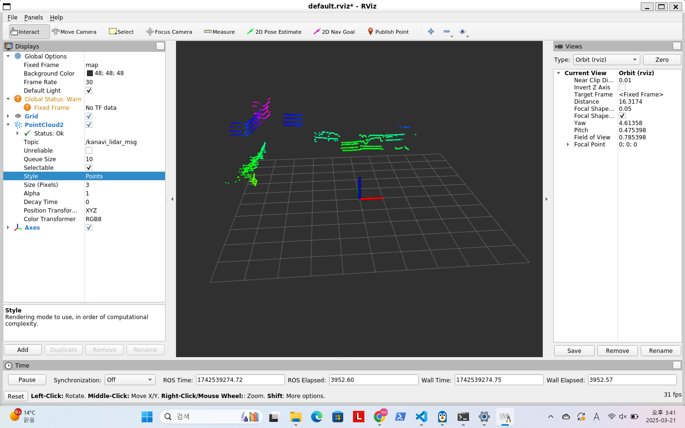

# 🚀 Kanavi Mobility LiDAR ROS 드라이버

<div align="center">

**🌐 Language: [🇺🇸 English](README.md) | [🇰🇷 한국어](README.ko.md)**


**카네비모빌리티 라이다 센서 ROS 드라이버**

</div>

---

## ✨ 주요 기능

- **하이브리드 아키텍처** - ROS1과 ROS2를 하나의 소스 트리에서 동시 지원
- **지원 모델** - R2, R4, R270 라이다 센서

## 🖥️ ROS 호환 버전

| ROS 버전 | Ubuntu 18.04 | Ubuntu 20.04 | Ubuntu 22.04 | Ubuntu 24.04 |
|----------|---------------|---------------|---------------|---------------|
| **ROS1** | ✅ Melodic | ✅ Noetic | - | - |
| **ROS2** | - | ✅ Foxy | ✅ Humble | ⚠️ Jazzy/Rolling |

> ✅ **테스트됨** | ⚠️ **테스트되지 않음**

## 🎯 빠른 시작

### 사전 요구사항

시스템에 ROS1 또는 ROS2가 설치되어 있어야 합니다.

### 빌드 및 실행

<details>
<summary>🟢 <b>ROS1 (Noetic / Melodic)</b></summary>

```bash
# 빌드
catkin_make
source devel/setup.bash

# R4 - 기본 실행
rosrun kanavi_vl R4 -i 192.168.123.100 5000 -m 224.0.0.5

# 디버그 출력과 함께 실행
rosrun kanavi_vl R4 -i 192.168.123.100 5000 -m 224.0.0.5 -d
```

</details>

<details>
<summary>🟠 <b>ROS2 (Humble / Foxy)</b></summary>

```bash
# 빌드
colcon build
source install/setup.bash

# R4 - 기본 실행
ros2 run kanavi_vl R4 -i 192.168.123.100 5000 -m 224.0.0.5

# 타임스탬프 디버그 출력과 함께 실행
ros2 run kanavi_vl R4 -i 192.168.123.100 5000 -m 224.0.0.5 -t
```

</details>

## 🛠️ 사용법

다음 명령어로 도움말을 확인하세요:

```bash
kanavi_vl -h
```

<details>
<summary><b>도움말 출력 결과</b></summary>

```bash
Usage: kanavi_vl [OPTION]...

Network options:
  -i [ip] [port]    Set network information
  -m [ip]           Set multicast IP

ROS options:
  -fix [name]       Set fixed frame name for rviz
  -topic [name]     Set topic name for rviz

Debug options:
  -d                Enable debug log output
  -t                Enable timestamp debug log output
```

</details>

### 📝 파라미터 참조

| 파라미터 | 설명 | 예시 |
|----------|------|------|
| `-i` | 네트워크 IP 및 포트 | `-i 192.168.0.1 8888` |
| `-m` | 멀티캐스트 IP 주소 | `-m 224.0.0.1` |
| `-fix` | RViz용 고정 프레임 ID | `-fix map` |
| `-topic` | ROS 토픽 이름 | `-topic scan` |
| `-d` | 디버그 로깅 활성화 | `-d` |
| `-t` | 타임스탬프 디버그 로깅 활성화 | `-t` |

### 🎯 예시 명령어

<details>
<summary><b>기본 사용법</b></summary>

```bash
# ROS1 - R2 모델
rosrun kanavi_vl R2 -i 192.168.123.100 5000 -m 224.0.0.5

# ROS2 - R270 모델 (커스텀 토픽 사용)
ros2 run kanavi_vl R270 -i 192.168.123.100 5000 -m 224.0.0.5 -topic kanavi_scan
```

</details>

<details>
<summary><b>고급 설정</b></summary>

```bash
# RViz용 커스텀 프레임 및 토픽
rosrun kanavi_vl R270 -i 192.168.123.100 5000 -m 224.0.0.5 -fix map -topic kanavi_r270_msg

# 타임스탬프가 포함된 디버그 모드
ros2 run kanavi_vl R4 -i 192.168.123.100 5000 -m 224.0.0.5 -t
```

</details>

## 🏗️ 아키텍처

### 프로젝트 구조

```
kanavi_vl/
└── 📁 src/
    └── 📁 kanavi_vl/
        ├── 📁 include/
        │   ├── 🔧 argv_parser.hpp      # CLI 인수 파싱 클래스
        │   ├── 📊 common.h             # 공통 상수, 매크로 및 LiDAR 모델별 스펙 정의
        │   ├── 🛟 helper.h             # 도움말 메시지 출력 및 ROS1/ROS2 헬프 옵션 체크 함수
        │   ├── 📦 kanavi_datagram.h    # LiDAR 원시 데이터 처리 및 저장을 위한 데이터그램 클래스
        │   ├── 🔍 kanavi_lidar.h       # LiDAR 데이터 파싱 및 처리 메인 클래스
        │   ├── 📡 udp.h                # UDP 소켓 통신 클래스
        │   └── 📁 kanavi_vl/
        │       ├── 📁 ros1/
        │       │   └── kanavi_node.h   # ROS1 노드 정의
        │       └── 📁 ros2/
        │           └── kanavi_node.h   # ROS2 노드 정의
        ├── 📁 src/
        │   ├── 📁 lidar/              
        │   │   ├── CMakeLists.txt      # 라이다 모듈 빌드 설정
        │   │   ├── kanavi_datagram.cpp # 데이터그램 클래스 구현
        │   │   └── kanavi_lidar.cpp    # LiDAR 원시 데이터 파싱 및 모델별 처리 로직 구현
        │   ├── 📁 node_ros1/           
        │   │   ├── CMakeLists.txt      # ROS1 노드 빌드 설정
        │   │   └── kanavi_node.cpp     # ROS1 노드 구현
        │   ├── 📁 node_ros2/          
        │   │   ├── CMakeLists.txt      # ROS2 노드 빌드 설정
        │   │   └── kanavi_node.cpp     # ROS2 노드 구현
        │   ├── 📁 R2/                 
        │   │   └── main.cpp            # R2 모델 실행 메인 파일
        │   ├── 📁 R4/                 
        │   │   └── main.cpp            # R4 모델 실행 메인 파일
        │   ├── 📁 R270/               
        │   │   └── main.cpp            # R270 모델 실행 메인 파일
        │   └── 📁 udp/                
        │       ├── CMakeLists.txt      # UDP 모듈 빌드 설정
        │       └── udp.cpp             # UDP 소켓 통신 구현
        ├── 📄 CMakeLists.txt          
        └── 📄 package.xml             
```

## 📸 실행 모습

<details>
<summary><b>ROS1 실행 결과</b></summary>

&nbsp;

**[ R4 모델 ]**



&nbsp;

**[ R270 모델 ]**


</details>

<details>
<summary><b>ROS2 실행 결과</b></summary>

&nbsp;

**[ R4 모델 ]**


&nbsp;

**[ R270 모델 ]**


</details>

## 🔧 문제 해결

<details>
<summary><b>🌐 네트워크 문제</b></summary>

**🤔**: 라이다 데이터를 수신하지 못함

**해결방법**:
- ✅ `-i` 옵션으로 IP/포트 설정 확인
- ✅ 방화벽 설정 확인
- ✅ 라이다와 호스트가 같은 네트워크에 있는지 확인
- ✅ `ping` 명령어로 연결 테스트

</details>

<details>
<summary><b>🎯 ROS2 토픽 문제</b></summary>

**🤔**: RViz2에서 토픽이 보이지 않음

**해결방법**:
- ✅ RViz2 인스턴스를 2개 이상 실행 후 재시도
- ✅ `rostopic list` (ROS1) 또는 `ros2 topic list` (ROS2)로 토픽 이름 확인
- ✅ `-d` 디버그 플래그로 노드가 퍼블리시하는지 확인

</details>

<details>
<summary><b>🏗️ 빌드 문제</b></summary>

**🤔**: 오류로 인한 빌드 실패

**해결방법**:
- ✅ ROS 환경 소스: `source /opt/ros/[humble]/setup.bash`
- ✅ 의존성 설치: `rosdep install --from-paths src --ignore-src -r -y`
- ✅ 클린 빌드: `rm -rf build/ devel/` (ROS1) 또는 `rm -rf build/ install/` (ROS2)

</details>

## 🤝 기여하기

카네비모빌리티는 여러분의 기여를 환영합니다!

- 🐛 **버그 신고** - 발견한 문제점을 알려주세요   
- 💡 **기능 제안** - 새로운 아이디어를 공유해 주세요   
- 🔧 **풀 리퀘스트** - 코드 개선사항을 제출해 주세요   

## 📄 라이선스

이 프로젝트는 **BSD 3-Clause License** 하에 배포됩니다.  
자세한 내용은 [LICENSE](LICENSE) 파일을 참조하세요.

---

<div align="center">
<br>

<br>

[📧 Contact](mailto:sensor@kanavi-mobility.com) • [🌐 Website](https://kanavi-mobility.com/)

</div>