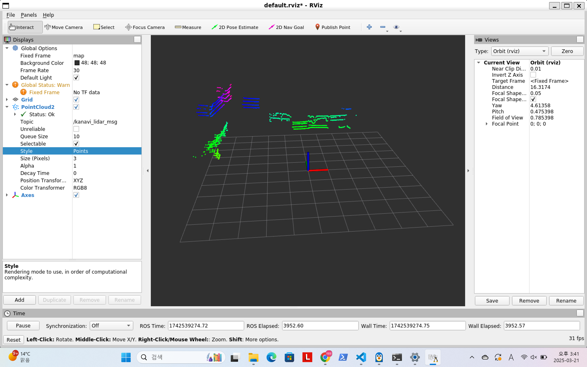
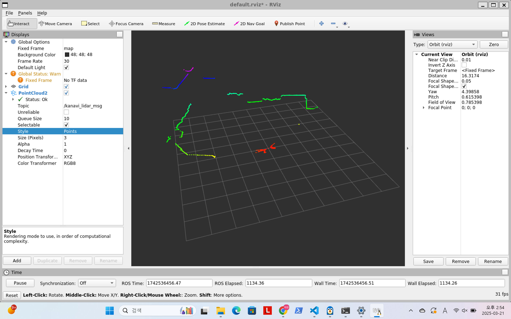
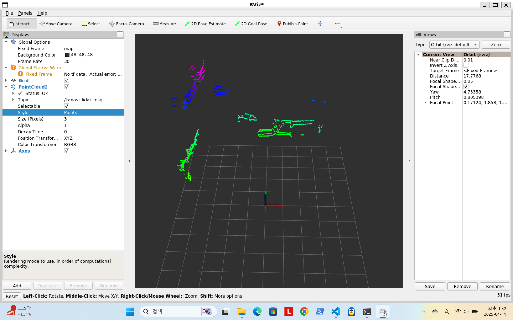
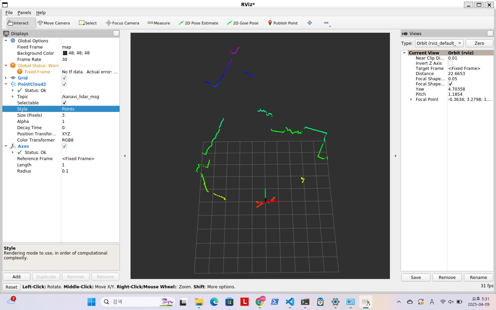

# 🚀 Kanavi Mobility LiDAR ROS Driver

<div align="center">

**🌐 Language: [🇺🇸 English](README.md) | [🇰🇷 한국어](README.ko.md)**


**Kanavi Mobility LiDAR sensor ROS driver**

</div>

---

## ✨ Key Features

- **Hybrid Architecture** - Simultaneous support for ROS1 and ROS2 in a single source tree
- **Supported Models** - R2, R4, R270 LiDAR sensors

## 🖥️ ROS Compatibility

| ROS Version | Ubuntu 18.04 | Ubuntu 20.04 | Ubuntu 22.04 | Ubuntu 24.04 |
|-------------|---------------|---------------|---------------|---------------|
| **ROS1** | ✅ Melodic | ✅ Noetic | - | - |
| **ROS2** | - | ✅ Foxy | ✅ Humble | ⚠️ Jazzy/Rolling |

> ✅ **Tested** | ⚠️ **Not tested**

## 🎯 Quick Start

### Prerequisites

ROS1 or ROS2 must be installed on your system.

### Build and Run

<details>
<summary>🟢 <b>ROS1 (Noetic / Melodic)</b></summary>

```bash
# Build
catkin_make
source devel/setup.bash

# R4 - Basic execution
rosrun kanavi_vl R4 -i 192.168.123.100 5000 -m 224.0.0.5

# Run with debug output
rosrun kanavi_vl R4 -i 192.168.123.100 5000 -m 224.0.0.5 -d
```

</details>

<details>
<summary>🟠 <b>ROS2 (Humble / Foxy)</b></summary>

```bash
# Build
colcon build
source install/setup.bash

# R4 - Basic execution
ros2 run kanavi_vl R4 -i 192.168.123.100 5000 -m 224.0.0.5

# Run with timestamp debug output
ros2 run kanavi_vl R4 -i 192.168.123.100 5000 -m 224.0.0.5 -t
```

</details>

## 🛠️ Usage

To see help options, run:

```bash
kanavi_vl -h
```

<details>
<summary><b>Help Output</b></summary>

```bash
Usage: kanavi_vl [OPTION]...

Network options:
  -i [ip] [port]    Set network information
  -m [ip]           Set multicast IP

ROS options:
  -fix [name]       Set fixed frame name for rviz
  -topic [name]     Set topic name for rviz

Debug options:
  -d                Enable debug log output
  -t                Enable timestamp debug log output
```

</details>

### 📝 Parameter Reference

| Parameter | Description | Example |
|-----------|-------------|---------|
| `-i` | Network IP and port | `-i 192.168.0.1 8888` |
| `-m` | Multicast IP address | `-m 224.0.0.1` |
| `-fix` | Fixed frame ID for RViz | `-fix map` |
| `-topic` | ROS topic name | `-topic scan` |
| `-d` | Enable debug logging | `-d` |
| `-t` | Enable timestamp debug logging | `-t` |

### 🎯 Example Commands

<details>
<summary><b>Basic Usage</b></summary>

```bash
# ROS1 - R2 model
rosrun kanavi_vl R2 -i 192.168.123.100 5000 -m 224.0.0.5

# ROS2 - R270 model (with custom topic)
ros2 run kanavi_vl R270 -i 192.168.123.100 5000 -m 224.0.0.5 -topic kanavi_scan
```

</details>

<details>
<summary><b>Advanced Configuration</b></summary>

```bash
# Custom frame and topic for RViz
rosrun kanavi_vl R270 -i 192.168.123.100 5000 -m 224.0.0.5 -fix map -topic kanavi_r270_msg

# Debug mode with timestamp
ros2 run kanavi_vl R4 -i 192.168.123.100 5000 -m 224.0.0.5 -t
```

</details>

## 🏗️ Architecture

### Project Structure

```
kanavi_vl/
└── 📁 src/
    └── 📁 kanavi_vl/
        ├── 📁 include/
        │   ├── 🔧 argv_parser.hpp      # Command line argument parsing class
        │   ├── 📊 common.h             # Common constants, macros and LiDAR model specifications
        │   ├── 🛟 helper.h             # Help message output and ROS1/ROS2 help option check functions
        │   ├── 📦 kanavi_datagram.h    # Datagram class for LiDAR raw data processing and storage
        │   ├── 🔍 kanavi_lidar.h       # Main LiDAR data parsing and processing class
        │   ├── 📡 udp.h                # UDP socket communication class
        │   └── 📁 kanavi_vl/
        │       ├── 📁 ros1/
        │       │   └── kanavi_node.h   # ROS1 node definition
        │       └── 📁 ros2/
        │           └── kanavi_node.h   # ROS2 node definition
        ├── 📁 src/
        │   ├── 📁 lidar/              
        │   │   ├── CMakeLists.txt      # LiDAR module build configuration
        │   │   ├── kanavi_datagram.cpp # Datagram class implementation
        │   │   └── kanavi_lidar.cpp    # LiDAR raw data parsing and model-specific processing logic
        │   ├── 📁 node_ros1/           
        │   │   ├── CMakeLists.txt      # ROS1 node build configuration
        │   │   └── kanavi_node.cpp     # ROS1 node implementation
        │   ├── 📁 node_ros2/          
        │   │   ├── CMakeLists.txt      # ROS2 node build configuration
        │   │   └── kanavi_node.cpp     # ROS2 node implementation
        │   ├── 📁 R2/                 
        │   │   └── main.cpp            # R2 model main execution file
        │   ├── 📁 R4/                 
        │   │   └── main.cpp            # R4 model main execution file
        │   ├── 📁 R270/               
        │   │   └── main.cpp            # R270 model main execution file
        │   └── 📁 udp/                
        │       ├── CMakeLists.txt      # UDP module build configuration
        │       └── udp.cpp             # UDP socket communication implementation
        ├── 📄 CMakeLists.txt          
        └── 📄 package.xml             
```

## 📸 Screenshots

<details>
<summary><b>ROS1 Execution Results</b></summary>

&nbsp;

**[ R4 Model ]**



&nbsp;

**[ R270 Model ]**



</details>

<details>
<summary><b>ROS2 Execution Results</b></summary>

&nbsp;

**[ R4 Model ]**



&nbsp;

**[ R270 Model ]**



</details>

## 🔧 Troubleshooting

<details>
<summary><b>🌐 Network Issues</b></summary>

**🤔**: Unable to receive LiDAR data

**Solution**:
- ✅ Check IP/port settings with `-i` option
- ✅ Check firewall settings
- ✅ Ensure LiDAR and host are on the same network
- ✅ Test connection with `ping` command

</details>

<details>
<summary><b>🎯 ROS2 Topic Issues</b></summary>

**🤔**: Topics not visible in RViz2

**Solution**:
- ✅ Run multiple RViz2 instances and retry
- ✅ Check topic names with `rostopic list` (ROS1) or `ros2 topic list` (ROS2)
- ✅ Use `-d` debug flag to verify node is publishing

</details>

<details>
<summary><b>🏗️ Build Issues</b></summary>

**🤔**: Build failure due to errors

**Solution**:
- ✅ Source ROS environment: `source /opt/ros/[humble]/setup.bash`
- ✅ Install dependencies: `rosdep install --from-paths src --ignore-src -r -y`
- ✅ Clean build: `rm -rf build/ devel/` (ROS1) or `rm -rf build/ install/` (ROS2)

</details>

## 🤝 Contributing

Kanavi Mobility welcomes your contributions!

- 🐛 **Bug Reports** - Let us know about any issues you find   
- 💡 **Feature Suggestions** - Share your new ideas with us   
- 🔧 **Pull Requests** - Submit your code improvements   

## 📄 License

This project is distributed under the **BSD 3-Clause License**.  
See the [LICENSE](LICENSE) file for details.

---

<div align="center">
<br>

<br>

[📧 Contact](mailto:sensor@kanavi-mobility.com) • [🌐 Website](https://kanavi-mobility.com/)

</div>